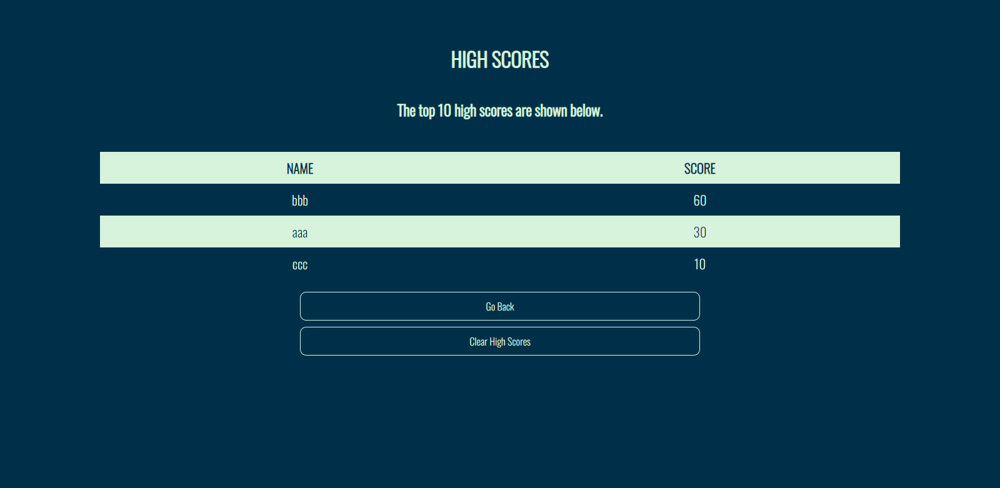

# Module 4 Challenge - JavaScript Quiz

## Table of contents

- [Overview](#overview)
  - [The challenge](#the-challenge)
  - [User Story](#user-story)
  - [Acceptance Criteria](#acceptance-criteria)
  - [Screenshot](#screenshot)
  - [Links](#links)
- [My process](#my-process)
  - [Built with](#built-with)
  - [What I learnt](#what-i-learnt)
 
## Overview

### The challenge

As you proceed in your journey to becoming a full-stack web developer, it’s likely that you’ll be asked to complete a coding assessment, perhaps as part of an interview process. A typical coding assessment is a combination of multiple-choice questions and interactive coding challenges.

To help you become familiar with these tests and give you a chance to apply the skills from this module, this week’s Challenge invites you to build a timed coding quiz with multiple-choice questions. This app will run in the browser, and will feature dynamically updated HTML and CSS powered by JavaScript code that you write. It will have a clean, polished, and responsive user interface. This week’s coursework will teach you all the skills you need to succeed in this assignment.

### User Story

```
AS A coding boot camp student
I WANT to take a timed quiz on JavaScript fundamentals that stores high scores
SO THAT I can gauge my progress compared to my peers
```

### Acceptance Criteria

```
GIVEN I am taking a code quiz
WHEN I click the start button
THEN a timer starts and I am presented with a question
WHEN I answer a question
THEN I am presented with another question
WHEN I answer a question incorrectly
THEN time is subtracted from the clock
WHEN all questions are answered or the timer reaches 0
THEN the game is over
WHEN the game is over
THEN I can save my initials and score
```

### Screenshot
**START PAGE**


**QUIZ PAGE**


**WRONG ANSWER**


**END PAGE**


**HIGHSCORES PAGE**



### Links

- Github Repository URL: [Github Repository](https://github.com/rmdn321/4-JS-Quiz)
- Github Pages URL: [Github Pages](https://rmdn321.github.io/4-JS-Quiz/)

## My process

### Built with

- Semantic HTML5 markup
- CSS
- Javascript

### What I learnt

- Identify the DOM and its relationship to HTML.

- Select and dynamically generate HTML elements and content using Web API methods.

- Implement DOM API methods to handle events like key presses and mouse clicks.

- Explain event propagation and implement handling functions.

- Store and retrieve data using the browser's local and session storage.


